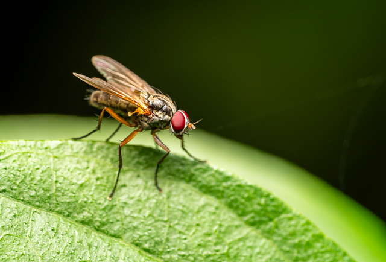

# 제목1
## 제목2
### 제목3
#### 제목4
##### 제목5
###### 제목6

h1
====

h2
-

가나다
라마바

별별별
***
**안녕**
---
가나다  
라마바

가나다 
라마바

5시 기상  
6시30분 출발  
7시 버스  
8시40분 강남 도착  
9시 삼성중앙역 도착  
9시5분 강의장 도착  

*수업*

__6시 수업 종료__  
6시 30분 강남 도착  
7시 버스  
8시 30분 집 도착  
10시 잘 준비  
~~__<h3>-><mark>수면</mark> 7시간 보장__~~
>집
>>가고
>>>싶다
>>>>오늘 밥 약속
>>>>>가기 싫다
>>>>>>취소할까
>>>>>>>피곤해서 못간다 해야지

1. 치킨
2. 피자
3. 햄버거
---
1. 짜장면
1. 짬뽕
3. 탕수육

* 눈
- 코
+ 입
    - 입술
    - 이빨
    - 빨대
    - 대나무
    - 무릎팍
    - 팍...팍팍팍팍팍팍

|제목1|제목000000000000002|제목3|
|:-|-:|:-:|
|내용000000000000000000001|내용2|내용3|
[텍스트](https://pixabay.com)
)